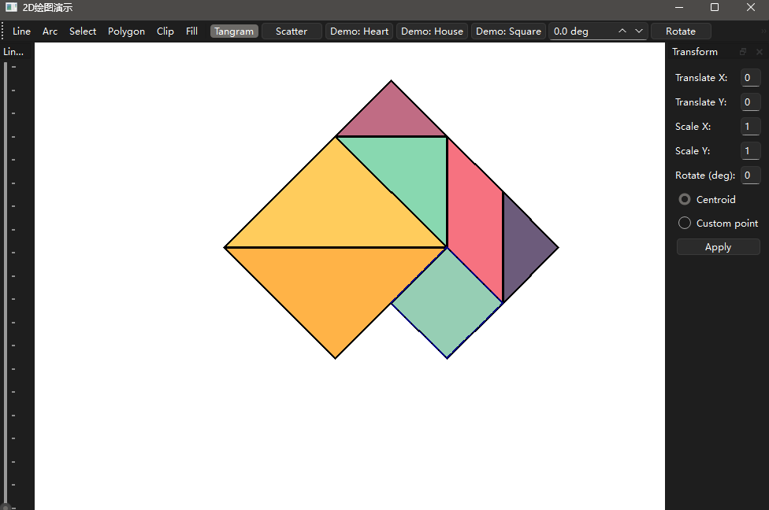

# Graphic_Tangram- 二维图形引擎与七巧板仿真系统
##此项目是一个基于 Qt 6 (C++) 开发的综合性二维矢量图形处理引擎。本项目不仅实现了一个功能完备的绘图板（支持图元绘制、填充、裁剪与变换），还在其基础上构建了一个七巧板（Tangram）互动游戏，展示了计算机图形学核心算法的工程化应用。

**📖 项目简介**

**本项目旨在通过底层代码实现经典的计算机图形学算法，而非单纯调用图形库 API。项目采用分层架构设计，将渲染核心、交互逻辑与数据模型解耦，实现了从基础图元绘制到复杂几何变换（如七巧板的平移、旋转、吸附）的完整功能。**

**🛠️ 技术架构与核心算法**

**参考《计算机图形学报告》，本项目在技术实现上具有以下核心亮点：**

**1\. 自研图形渲染引擎**

**项目封装了名为 DrawEngine 的核心绘图模块，底层实现了多种经典图形学算法，摆脱了对高层绘图接口的依赖：**

- **图元生成：实现了 Bresenham 算法 用于直线绘制，以及中点画圆算法用于圆弧/圆形绘制。**
- **区域填充：实现了 扫描线填充算法 (Scan-line Filling) 和 种子填充算法，支持对复杂多边形区域的着色。**
- **图形裁剪：集成了裁剪算法（如 Cohen-Sutherland 或 Liang-Barsky），实现了视口内的图形精确裁剪。**

**2\. 面向对象的架构设计**

**为了降低维护成本并提高代码复用性，项目采用了现代 C++ 标准（C++17）：**

- **抽象基类与多态：定义了 Shape 抽象基类，所有图元（LineShape, ArcShape, TangramPiece）均继承自此，利用虚函数实现统一的绘制与变换接口。**
- **智能指针管理：广泛使用 std::shared_ptr 进行对象生命周期管理，有效避免了内存泄漏，增强了系统的稳定性。**
- **工具模式 (State Pattern)：通过 BaseTool 及其派生类（LineTool, SelectTool, TangramTool）管理不同的交互状态，实现了交互逻辑与渲染逻辑的分离。**

**3\. 几何变换与数学模型**

- **矩阵变换：基于齐次坐标系，手动实现了平移、旋转、缩放的矩阵运算。**
- **复合变换：支持以“质心”为原点或“自定义点”为原点的复杂几何变换，这在七巧板的旋转交互中起到了关键作用。**

**4\. 人性化的交互系统**

- **吸附对齐 (Snapping)：在七巧板模式中，引入了基于距离和角度阈值的碰撞检测算法。当拼图接近目标位置时，系统会自动进行吸附对齐，大幅提升了用户的操作体验。**
- **动画插值系统：引入 QTimer 和 QElapsedTimer 构建动画循环，通过线性插值（Lerp）实现了拼图从当前姿态到目标姿态的平滑过渡（如“演示：心形”、“演示：房子”）。**

**🎮 功能特性**

**基础绘图模块**

- **基本图元：直线、圆弧、多边形、贝塞尔曲线。**
- **图形编辑：线宽调节、线型选择（实线/虚线）、线帽样式调整。**
- **高级操作：多边形扫描线填充、光栅填充、窗口裁剪。**

**七巧板游戏模块 (Tangram)**

- **自由模式：支持对七块拼图的独立选中、拖拽平移和指定角度旋转。**
- **目标挑战：内置“心形”、“房子”、“正方形”等目标造型。**
- **自动演示：支持一键演示拼图归位动画。**
- **智能辅助：具备自动吸附功能，辅助用户完成拼接。**

**💻 开发环境与构建**

- **编程语言：C++ (Standard: C++17)**
- **GUI 框架：Qt 6.x (兼容 Qt 5.15+)**
- **构建工具：CMake 3.16+**
- **编译器：MSVC / MinGW / GCC / Clang**

**🖥️ 核心算法实现原理**

本项目不依赖高层绘图 API (如 QPainter::drawLine 等) 进行渲染，而是基于计算机图形学底层原理实现了核心图元的生成与处理。以下是关键算法的实现细节：

**1\. 直线生成：Bresenham 算法**

**代码位置:** lineshape.cpp / drawengine.cpp

项目采用了整数增量运算的 **Bresenham 算法** 来绘制直线，避免了浮点数运算，提高了渲染效率。

- **原理**：通过判断直线在像素网格中的“误差项” $d$，决定下一个像素点是取 $(x+1, y)$ 还是 $(x+1, y+1)$。
- **实现逻辑**：
    1.  初始化误差项 $d$ (通常为 $2\\Delta y - \\Delta x$)。
    2.  在主位移方向（如 x 轴）循环步进。
    3.  若 $d > 0$，则辅位移方向（y 轴）进位，更新 $d = d + 2(\\Delta y - \\Delta x)$。
    4.  若 $d \\le 0$，则辅位移方向不变，更新 $d = d + 2\\Delta y$。
    5.  利用对称性处理四个象限及斜率 $|k| > 1$ 的情况。

**2\. 多边形填充：扫描线算法 (Scan-Line Filling)**

**代码位置:** rasterfillshape.cpp / filltool.cpp

针对多边形区域的颜色填充，实现了基于 **边表 (ET)** 和 **活动边表 (AET)** 的扫描线算法。

- **数据结构**：
    - **Edge Table (ET)**: 按边的下端点 y 坐标分类存储所有边，包含 $x_{min}$、$\\Delta x = 1/k$、$y_{max}$。
    - **Active Edge Table (AET)**: 存储当前扫描线 $y$ 相交的边，按交点 x 坐标排序。
- **算法流程**：
    1.  从多边形最低的扫描线开始向上遍历。
    2.  将 $y = current\\\_scanline$ 的新边从 ET 移入 AET。
    3.  在 AET 中按 x 坐标对边进行排序。
    4.  配对 AET 中的边（如 edge\[0\] 与 edge\[1\]，edge\[2\] 与 edge\[3\]...），填充两边之间的像素区间。
    5.  更新 AET 中各边的 x 坐标 ($x = x + 1/k$)，并移除已处理完的边 ($y = y_{max}$)。

**3\. 图形裁剪：Cohen-Sutherland 算法**

**代码位置:** cliptool.cpp

在视口缩放或选区操作中，采用了 **Cohen-Sutherland** 编码算法进行直线段裁剪。

- **区域编码**：将二维平面划分为 9 个区域，使用 4 位二进制码 (D3 D2 D1 D0) 标识端点位置：
    - D3: Top, D2: Bottom, D1: Right, D0: Left。
- **裁剪逻辑**：
    - **简取 (Trivial Accept)**: code1 | code2 == 0 (两端点都在窗口内)。
    - **简弃 (Trivial Reject)**: code1 & code2 != 0 (两端点在窗口同一外侧)。
    - **求交**：若非上述情况，则按位判断端点处于哪个外侧区域，计算直线与窗口边界的交点，用交点替换原端点，重复上述过程直至线段被完全接受或拒绝。

**4\. 几何变换：二维齐次矩阵**

**代码位置:** shape.h (Transform) / tangramgame.cpp

七巧板的平移、旋转及缩放操作均通过 **3x3 齐次矩阵 (Homogeneous Matrix)** 运算实现。

- **复合变换公式**：

$$P' = M \\cdot P = (T \\cdot R \\cdot T^{-1}) \\cdot P$$

- - 为了实现“围绕质心旋转”，算法先构造平移矩阵 $T^{-1}$ 将图形中心移至原点，应用旋转矩阵 $R$，再通过 $T$ 移回原位。
- **旋转矩阵**：

$$ R(\\theta) = \\begin{bmatrix} \\cos\\theta & -\\sin\\theta & 0 \\\\ \\sin\\theta & \\cos\\theta & 0 \\\\ 0 & 0 & 1 \\end{bmatrix}$$

**5\. 交互与碰撞：吸附对齐 (Snapping)**

**代码位置:** tangramgame.cpp

为了提升七巧板游戏的拼接体验，实现了基于**欧氏距离**的自动吸附算法。

- **判定机制**：
    1.  在 mouseReleaseEvent 中，遍历当前拼图的所有顶点 $V_{current}$ 与目标形状的所有顶点 $V_{target}$。
    2.  计算欧氏距离 $D = ||V_{current} - V_{target}||$。
    3.  **阈值判断**：若 $D < \\text{THRESHOLD}$ (如 15像素) 且旋转角度偏差 $|\\Delta \\theta| < 5^{\\circ}$。
    4.  **强制归位**：系统自动构建平移和旋转矩阵，将拼图“吸附”到目标位置，消除微小误差。
